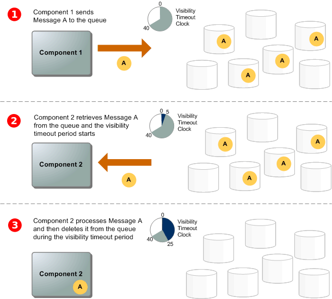

# Nhật ký tự học Solution Architecture Associate AWS - Week 4 (25/10/2021 - 31/10/2021)

## Những thứ mình đã học được trong một tuần qua:

### Design highly-available workload with Auto Scaling + ELB:

Auto Scaling là dịch vụ cho phép bảo đảm rằng dịch vụ của bạn có đủ tài nguyên tính toán (EC2 Instance) để xử lý các yêu cầu. Bạn thiết đặt các thông số như số instance tối thiểu, tối đa và cần thiết, và Auto Scaling sẽ duy trì Auto Scaling group có được số instance như mong muốn

Launch template là template sử dụng để Auto Scaling khởi tạo các instance cho group hoặc khi cần scale out. Nó bao gồm các thông tin như AMI id, instance type, key pair. Việc này giúp cho việc khởi tạo instance trở nên thuận tiện, tránh lặp đi lặp lại các bước thủ công

Scaling policy là cách để Auto Scaling biết cách thực hiện việc tăng (scale out) hoặc giảm (scale in) số lượng instance trong group. Có 2 cách chính để scale : manually (thủ công) hoặc dynamically(tự động)

Manual scaling là tự thêm vào các instance, nếu bạn không cần quản lý tự động các instance hoặc muốn giữ chúng ở một số lượng như mong muốn

Dynamic scaling là dựa vào sự thay đổi trên lưu lượng các yêu cầu đến ứng dụng mà scale cho phù hợp, các phương án bao gồm:
+ Target tracking policy: bạn lựa chọn một metric cùng với giá trị yêu cầu. Khi metric đạt đến giá trị yêu cầu, hệ thống sẽ tính toán để scale số instance sao cho metric được giữ ở gần mức giá trị yêu cầu
+ Step scaling và Simple scaling: xác định các mức threshold theo nấc và số instance cần tăng tương ứng

### Thiết kế cơ chế Decoupling với SQS / ELB

Simple Queue Service (SQS) có thể được sử dụng để tạo nên cơ chế gắn kết lỏng lẻo (loosely coupled) giữa các thành phần trong hệ thống.

SQS thường được dùng trong hệ thống tin nhắn phân tán để giúp tách rời các thành phần trong hệ thống. Hệ thống này thường gồm 3 phần: các thành phần trong hệ phân tán, hệ thống queue (SQS) và tin nhắn trong queue

Vòng đời của một tin nhắn trong hệ thống:

Bước 1: Thành phần 1 sẽ gởi tin nhắn đến queue. Tin nhắn sẽ được sao chép và phân phối dư ra đến các server
Bước 2: Thành phần 2 sẽ yêu cầu tin nhắn từ queue. Trong thời gian thành phần này nhận và xử lý tin nhắn, tin nhắn này sẽ không phản hồi request từ các thành phần khác. Khoảng thời gian này gọi là **visibility timeout**
Bước 3: Sau khi xử lý xong, thành phần 2 sẽ xóa tin nhắn khỏi hệ thống

Các loại queue chính:
+ Standart queue: các tin nhắn sẽ được gởi ít nhất một lần, có thể bị trùng lặp và không đảm bảo trật tự
+ FIFO queue (First In First Out): các tin nhắn được gởi đúng một lần và chính xác theo thứ tự, không bị trùng lặp

Long polling: là cách để hạn chế phản hồi rỗng khi hệ thống yêu cầu liên tục từ queue (nhưng queue không có sẵn tin nhắn). Hệ thống sẽ chờ tin nhắn xuất hiện trên queue cho đến 20s trước khi trả về phản hồi.

Dead-letters queue: dùng để lưu trữ tin nhắn từ các queue khác mà không được xử lý.
Được dùng để debug message

### Resilient Storage

### S3

S3 là object storage. Các file cần lưu sẽ được lưu dưới dạng object trong S3 bucket

S3 được thiết kế để cung cấp 99.999999999% durability and 99.99% availability
S3 quản lý truy cập theo những cách sau:
+ S3 Bucket policy / IAM User policy
+ ACL
+ Block Public Access

Monitoring:
+ CloudWatch Alarm
+ CloudTrail log
+ Server Access log

Storage Class:
+ Standard: truy cập thường xuyên, ms
+ IA - Standard: ít truy cập ,ms
+ Glacier: minute to hour
+ Glacier Deep Archive: hours

Resiliency with multi AZ / Cross-region replication

...

